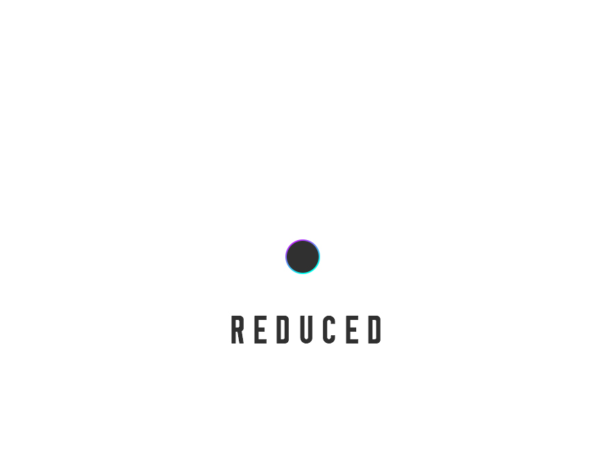

# 

# Reduced Theme

Basic Template for developing Wordpress Themes

Powered by: Sass (<http://sass-lang.com>) and Neat (http://neat.bourbon.io)

Features:

* Advance Custom Fields Global Settings
* Custom Post Types can be activated in Global Settings
* Google Fonts in functions.php
* Sticky Footer (http://mystrd.at/modern-clean-css-sticky-footer/)

